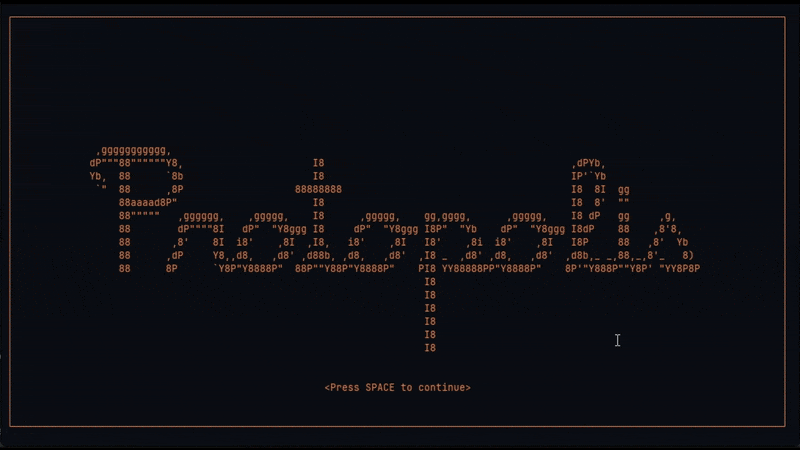

# 🤖 Protopolis

**A Rust-based AI multi-agent simulation framework (using Ollama)**

**Protopolis is a project that allows you to create and simulate interactions between AI agents in a colorful terminal environment. Agents can communicate with each other and with the user according to different states and energy levels.**

[](https://github.com/LightInn/protopolis/actions)
[](https://crates.io/crates/protopolis)
[](https://github.com/LightInn/protopolis)
[](https://crates.io/crates/protopolis)

<p align="center"> 
   
</p> 

> **⚠️ Warning:** This project is a work in progress (WIP) and will have frequent updates that may break various features.

## 📋 Features

- **🧠 Agent Simulation** with different states (Idle, Thinking, Speaking)
- **💬 Messaging System** between agents and with the user
- **🌈 Colorful Terminal Interface** for better visualization
- **⚡ Energy Management** for agents
- **🔄 Simple Commands** to control the simulation

## 🛠️ Installation

> **⚠️ Note:** Make sure to have [Ollama](https://ollama.ai) installed with the `llama3.2` model before continuing.

```bash
git clone https://github.com/LightInn/protopolis
cd protopolis
cargo build --release
```

## 🎮 Usage

To start the simulation:

```bash
cargo run --release
```

### Available Commands

- `start` - Start the simulation
- `pause` - Pause the simulation
- `resume` - Resume the simulation
- `stop` - Stop the simulation
- `exit` - Exit the application
- `topic <subject>` - Set a new discussion topic
- `msg <agent> <message>` - Send a message to a specific agent

## 🏗️ Architecture

The project is built around several key components:

- **Agents** - Entities with states and behaviors
- **Messaging System** - Asynchronous communication between agents
- **User Interface** - Colorful display in the terminal
- **Simulation** - Orchestration of interactions

## 🗺️ Roadmap

- [x] Basic terminal interface
- [x] Color system for agents
- [x] Communication between agents
- [ ] More complex agent personalities
- [ ] Save/load simulations
- [ ] Graphical visualization of interactions

## 🤝 Contribution

Contributions are welcome! Feel free to open an issue or a pull request.

## 📚 Inspired By

- [TyniTroupe](https://github.com/microsoft/TinyTroupe) - LLM-powered multiagent persona simulation

## 🔌 Powered By

<p align="center">
  
  <br>
  <a href="https://ollama.ai">Ollama</a> - Local LLM runner
</p>

## License

MIT © 2025 Breval LE FLOCH